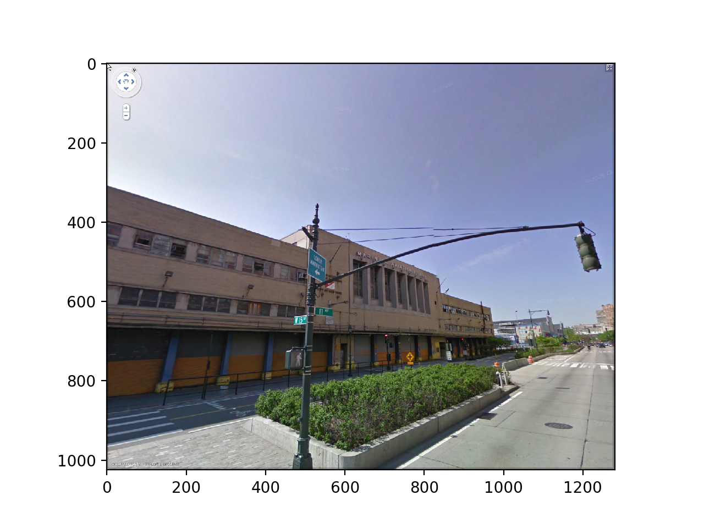
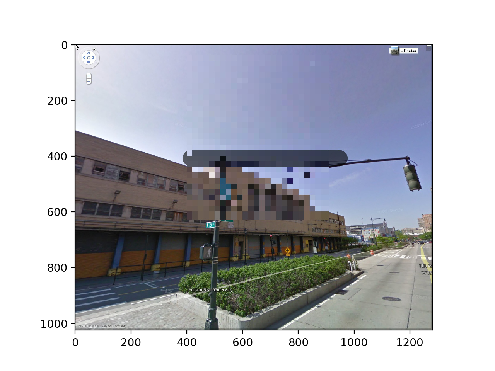
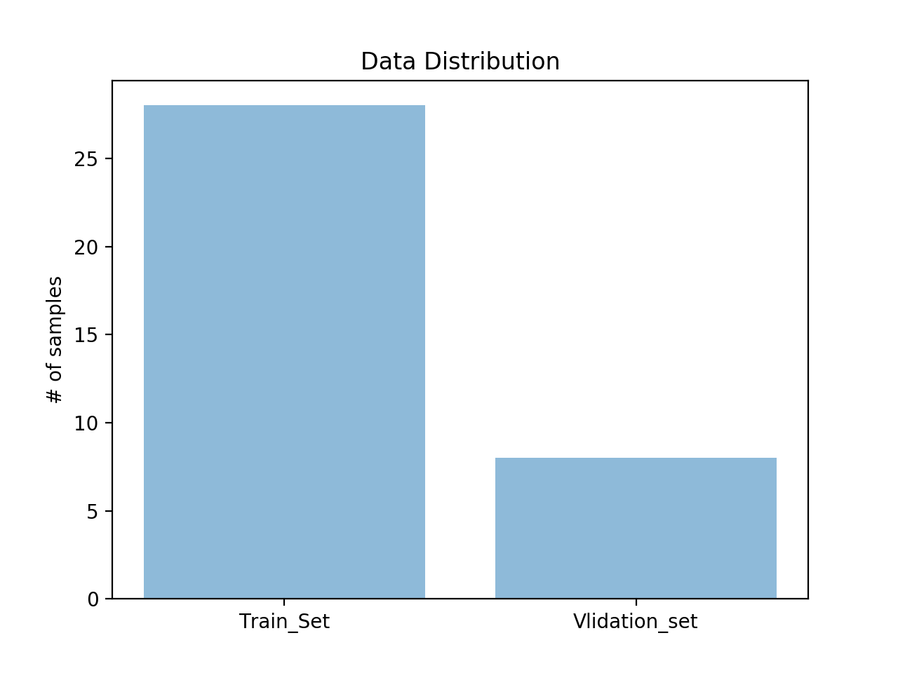

# Deep Crying: Recovering Blurred Images

## Data Extraction

### Datasets
- [Google Street View Dataset](https://www.crcv.ucf.edu/projects/GMCP_Geolocalization/#Dataset)
- MNIST
- CIFAR10

### Data Splitting

- Used `SubsetRandomSampler` from `torch.utils.data.sampler` to split data
- Current distribution 7:2:1 (Train:Validation:Test)

## Image blurring
 We will blur the images for model testing purpose by implement mosaic
 
### Mosaic
- Mosaic the middle part of each photo.
- Each photo has been processed in four different degrees.

### Small Examples

#### Clear Image

#### Mosaic Image

#### Small Sample Distribution

